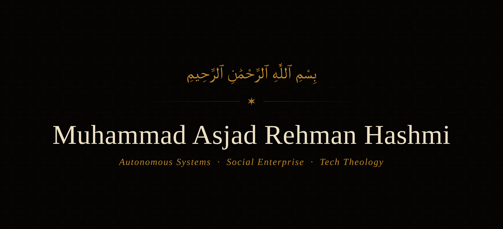
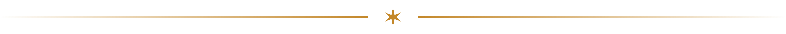

  

  Founder & engineer building autonomous systems, ethical supply chains, and faith-centered software. 
  CS + Political Science @ USM · 3× founder · Cato Institute Fellow

  
  
  

  

### About

I build defensible technology across three domains — **edge machine learning** for defense and critical infrastructure, **certified-organic supply chains**, and **software for faith communities**.

Currently studying Computer Science and Political Science at the University of Southern Mississippi (B.S./B.A., 2027), serving as VP of the Islamic Center of Hattiesburg, and researching religiosity and political participation as a **Cato Institute Summer Fellow**.

  

### Ventures

| Project | What it is | Status | Stack |
| --- | --- | --- | --- |
| **[AegisSwarm](https://aegisswarm.com)** | Counter-drone detection at the edge — YOLOv8-nano on Raspberry Pi 5 with 5-DOF servo tracking. 96.8% mAP@50. | Active · YC S26 | Python · YOLOv8 · OpenCV · FastAPI · AWS |
| **[Estrah](https://supply.estrah.com)** | GOTS + OCS + OEKO-TEX certified organic cotton, scaling into the US via B2B wholesale and luxury DTC. | Active | Next.js · Supabase · Stripe |
| **[Confer / Sadd](https://sadd.app)** | Sadaqah automation and phone-discipline app; iPad donation kiosk live at the Islamic Center of Hattiesburg. | Live | SwiftUI · Supabase · RevenueCat |
| **InfinixLeverage** | Voice AI call agents for hospitality and e-commerce, live with New South Restaurant Group and Kalalou. | Live | Voice AI · Eval frameworks |

  

### Tech

  
  
  
  
  

**Backend / Data** — Node.js · FastAPI · PostgreSQL · Supabase · Firebase
**Frontend** — React · Next.js · SwiftUI · Tailwind
**ML / CV** — PyTorch · OpenCV · YOLOv8
**Infra** — AWS · Vercel · Cloudflare · Docker · GitHub Actions

  

### Currently

- **Building** — AegisSwarm counter-drone stack · Estrah US distributor pipeline · Sadd/Confer donation OS
- **Researching** — Religiosity & political participation in Pakistan · Hanafi jurisprudence · IEEPA authority
- **Open to** — customer intros for AegisSwarm (defense / critical infra), manufacturing partners for Estrah, and senior startup engineering roles

  

  <picture>
    <source media="(prefers-color-scheme: dark)" srcset="https://github-readme-stats.vercel.app/api?username=asjad-rehman&show_icons=true&hide_border=true&count_private=true&include_all_commits=true&title_color=C4882A&icon_color=C4882A&text_color=EDE6D6&bg_color=00000000" />
    
  </picture>
  <picture>
    <source media="(prefers-color-scheme: dark)" srcset="https://github-readme-stats.vercel.app/api/top-langs/?username=asjad-rehman&layout=compact&hide_border=true&title_color=C4882A&text_color=EDE6D6&bg_color=00000000" />
    
  </picture>

  <a href="mailto:MuhammadAsjad.RehmanHashmi@gmail.com"><b>Get in touch →</b></a>

  بارك الله فيك — thanks for stopping by.

