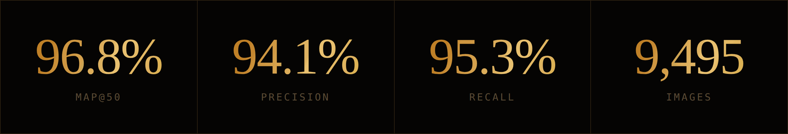

<div align="center">


<p><em>Three ventures built from zero. Defensible hardware, ethical supply chains, and faith-centered software — without losing the theology.</em></p>


[](https://asjadrehman.com)
[](https://linkedin.com/in/asjad-rehman)
[](mailto:MuhammadAsjad.RehmanHashmi@gmail.com)


</div>

### Flagship Ventures

<table>
<tr>
<td width="50%" valign="top">

**[AegisSwarm](https://aegisswarm.com)** &nbsp;

Counter-drone detection at the edge — YOLOv8-nano on Raspberry Pi 5, 5-DOF servo tracking. *96.8% mAP@50.*

`Python` `YOLOv8` `OpenCV` `FastAPI` `Raspberry Pi 5` `AWS`

</td>
<td width="50%" valign="top">

**[Estrah](https://supply.estrah.com)** &nbsp;

GOTS + OCS + OEKO-TEX certified organic cotton — scaling from manufacturing partnerships into the US market via B2B wholesale and luxury DTC.

`Next.js` `Supabase` `Stripe`

</td>
</tr>
<tr>
<td width="50%" valign="top">

**[Confer / Sadd](https://sadd.app)** &nbsp;

iPad kiosk live at the Islamic Center of Hattiesburg + iOS Sadaqah automation and phone discipline app.

`SwiftUI` `Supabase` `RevenueCat`

</td>
<td width="50%" valign="top">

**InfinixLeverage** &nbsp;

Voice AI call agents for hospitality and e-commerce. Live with New South Restaurant Group and Kalalou.com.

`Voice AI` `Evaluation Frameworks`

</td>
</tr>
</table>

<div align="center"></div>

### AegisSwarm · By The Numbers

<div align="center">




</div>

### Terminal Profile

```python
class AsjadRehman:
    def __init__(self):
        self.name      = "Muhammad Asjad Rehman Hashmi"
        self.education = ["B.S. Computer Science", "B.A. Political Science — USM, Spring 2027"]
        self.founded   = ["AegisSwarm", "Estrah", "Confer / Sadd Tech"]
        self.roles     = ["VP, Islamic Center of Hattiesburg", "Cato Institute Summer Fellow"]
        self.focus     = ["Edge ML for defense/critical infra", "Ethical supply chains", "Islamic political theology"]

    def mission(self):
        return "Build defensible autonomous systems and scale social enterprises — without losing the theology."

if __name__ == "__main__":
    AsjadRehman().mission()
```

<table>
<tr>
<td width="50%" valign="top">

**Currently building**<br>
AegisSwarm counter-drone stack · Estrah US distributor pipeline · Sadd/Confer donation OS

</td>
<td width="50%" valign="top">

**Currently researching**<br>
Religiosity &amp; political participation in Pakistan · Hanafi jurisprudence · IEEPA authority

</td>
</tr>
</table>

<div align="center"></div>

### Technology Arsenal

<div align="center">

**Backend / Full-Stack**
[](https://skillicons.dev)

**Frontend**
[](https://skillicons.dev)

**ML / Computer Vision**
[](https://skillicons.dev)

**DevOps / Infrastructure**
[](https://skillicons.dev)


</div>

### GitHub Analytics

<div align="center">


</div>

### Let's Talk

<div align="center">

**Building in autonomous systems, ethical supply chains, or faith-tech?**

Actively seeking **customer intros for AegisSwarm** (defense / critical infra) · **manufacturing partners for Estrah** · **senior engineering roles** (startup-stage, EB-1C path)

[](mailto:MuhammadAsjad.RehmanHashmi@gmail.com)
[](https://asjadrehman.com)
[](https://linkedin.com/in/asjad-rehman)


<sub>last updated · july 2026</sub>

</div>
