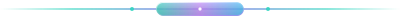

<div align="center">

<picture>
  <source media="(prefers-color-scheme: dark)" srcset="assets/banner-dark.svg">
  <source media="(prefers-color-scheme: light)" srcset="assets/banner-light.svg">
  
</picture>

<p><em>Three ventures built from zero. Autonomous systems, ethical supply chains, and faith-centered software.</em></p>

[](https://asjadrehman.com)
&nbsp;·&nbsp;
[](https://linkedin.com/in/asjad-rehman)
&nbsp;·&nbsp;
[](mailto:MuhammadAsjad.RehmanHashmi@gmail.com)
&nbsp;·&nbsp;
[](https://x.com/a5jadrehman)

<p align="center">
  <a href="https://github.com/asjad-rehman">
    
  </a>
</p>

<picture>
  <source media="(prefers-color-scheme: dark)" srcset="assets/divider-dark.svg">
  <source media="(prefers-color-scheme: light)" srcset="assets/divider-light.svg">
  
</picture>

</div>

### 🚀 Flagship Ventures

<table>
  <tr>
    <td width="50%" valign="top">
      <strong><a href="https://aegisswarm.com">AegisSwarm</a></strong> &nbsp;
      <br><br>
      Autonomous swarm defense: distributed, human-in-the-loop response systems for adversarial conditions.
      <br>
      <code>YOLOv8-nano, 96.8% mAP on 9,495+ swarm-scenario images.</code>
      <br><br>
      <code>Python</code> · <code>YOLOv8</code> · <code>OpenCV</code> · <code>FastAPI</code> · <code>Raspberry Pi 5</code> · <code>AWS</code>
    </td>
    <td width="50%" valign="top">
      <strong><a href="https://estrah.com">Estrah</a></strong> &nbsp;
      <br><br>
      GOTS-certified organic cotton, vertically manufactured in Punjab, Pakistan. Scaling B2B wholesale and luxury DTC.
      <br><br>
      <code>Next.js</code> · <code>Supabase</code> · <code>Stripe</code> · <code>PostgreSQL</code>
    </td>
  </tr>
  <tr>
    <td width="50%" valign="top">
      <strong><a href="https://confer.sadd.app">Confer</a></strong> &nbsp;
      <br><br>
      Donation infrastructure for community organizations: online donor checkout and an iPad kiosk flow, from a single system.
      <br><br>
      <code>Next.js</code> · <code>React</code> · <code>.NET MAUI</code> · <code>PostgreSQL</code>
    </td>
    <td width="50%" valign="top">
      <strong><a href="https://sadd.app">Sadd</a></strong> &nbsp;
      <br><br>
      A focus app built with intention, a deliberate barrier between you and the infinite feed.
      <br><br>
      <code>SwiftUI</code> · <code>iOS</code> · <code>Supabase</code> · <code>RevenueCat</code>
    </td>
  </tr>
  <tr>
    <td colspan="2" valign="top">
      <strong>InfinixLeverage</strong> &nbsp;
      <br><br>
      Operations Director: client success, delivery systems, and the plumbing that keeps voice AI systems shipping.
      <br><br>
      <code>Voice AI</code> · <code>Evaluation Frameworks</code> · <code>JavaScript</code> · <code>Docker</code>
    </td>
  </tr>
</table>

<div align="center">
<picture>
  <source media="(prefers-color-scheme: dark)" srcset="assets/divider-dark.svg">
  <source media="(prefers-color-scheme: light)" srcset="assets/divider-light.svg">
  
</picture>
</div>

### 👨🏻‍💻 Terminal Profile

```python
class AsjadRehman:
    def __init__(self):
        self.name        = "Muhammad Asjad Rehman Hashmi"
        self.education   = ["B.S. Computer Science", "B.A. Political Science — USM '27"]
        self.roles       = ["Founder @ AegisSwarm", "VP @ Islamic Center of Hattiesburg", "Cato Institute Summer Fellow"]
        self.philosophy  = "Building impactful systems — securely, cleanly, and consciously."
        
    def execute(self):
        return "Distributed systems, algorithmic defense, and human intention."
```

<table>
  <tr>
    <td width="50%" valign="top">
      <strong>🔭 Currently building</strong><br>
      <ul>
        <li>AegisSwarm edge counter-drone stack</li>
        <li>Estrah vertical supply-chain backend</li>
        <li>Sadd &amp; Confer donation ecosystem</li>
      </ul>
    </td>
    <td width="50%" valign="top">
      <strong>🌱 Currently researching</strong><br>
      <ul>
        <li>Religiosity &amp; political participation in Pakistan</li>
        <li>Hanafi jurisprudence &amp; ethical commerce</li>
        <li>IEEPA authority &amp; emergency economic powers</li>
      </ul>
    </td>
  </tr>
</table>

<div align="center">
<picture>
  <source media="(prefers-color-scheme: dark)" srcset="assets/divider-dark.svg">
  <source media="(prefers-color-scheme: light)" srcset="assets/divider-light.svg">
  
</picture>
</div>

### 🛠️ Technology Arsenal

<div align="center">
  <strong>Languages &amp; Core</strong><br>
  <a href="https://skillicons.dev"></a>
  <br><br>
  <strong>Frameworks &amp; Ecosystems</strong><br>
  <a href="https://skillicons.dev"></a>
  <br><br>
  <strong>Infrastructure &amp; Databases</strong><br>
  <a href="https://skillicons.dev"></a>
</div>

<div align="center">
<picture>
  <source media="(prefers-color-scheme: dark)" srcset="assets/divider-dark.svg">
  <source media="(prefers-color-scheme: light)" srcset="assets/divider-light.svg">
  
</picture>
</div>

### 📊 GitHub Activity &amp; Metrics

<p align="center">
  
  &nbsp;&nbsp;
  
</p>

<p align="center">
  
</p>

<div align="center">
<picture>
  <source media="(prefers-color-scheme: dark)" srcset="assets/divider-dark.svg">
  <source media="(prefers-color-scheme: light)" srcset="assets/divider-light.svg">
  
</picture>
</div>

<p align="center">
  <sub>System executing... EOF. Let's build something revolutionary together! 🚀</sub>
</p>
